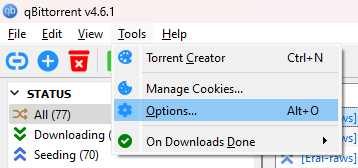
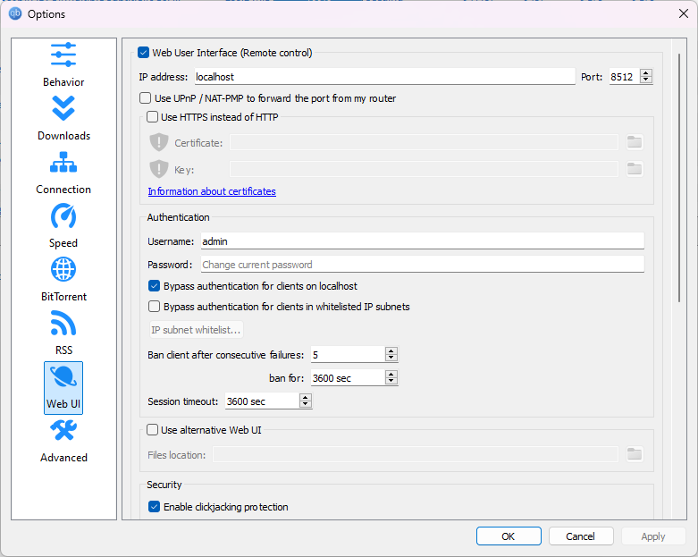
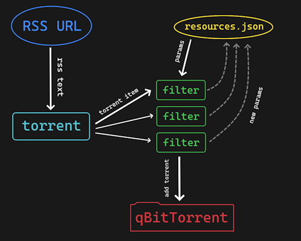

# RSS Torrent Fetch
Tool for automatically fetch torrents from RSS, and download them using qBitTorrent (Web API).

## Prerequisites

- Python 3.x.x
- Python requirements (install via `pip install -r requirements.txt`)
- [qBitTorrent](https://www.qbittorrent.org/download)

## Usage

1. Launch qBitTorrent and turn on Web API 
    + Go to `Tools` -> `Options` -> `Web UI`

    

    + Turn `Web User Interface (Remote control)` on

    + Set `IP Address` to `localhost` and choose some port

    + Turn `Bypass authentication for clients on localhost`

    

2. Open `config.ini`, set qBitTorrent Web UI URL and parameters for qBitTorrent ([qBitTorrent Wiki](https://github.com/qbittorrent/qBittorrent/wiki/WebUI-API-(qBittorrent-4.1)#add-new-torrent))

    Example:

    ```
    [fetch]
    fetch_interval = 600                # interval between fetches, in seconds
    resources_fp = resources.json       # path to resources to fetch

    [torrent]
    url = http://localhost:8512         # host and port, you chose in qBitTorrent

    [qbittorrent parameters]
    savepath = D:\Torrent               # directory to save downloaded files
    # and other parameters from qBitTorrent Wiki (url above)

    ```

3. Open `resources.json` and write resources you want to fetch in this format:

    + `rss_url` - URL to get RSS from
    + `torrent` - name of python function, declared in file `torrents.py` (different for different torrent RSS feeds)
    + `filter` - name of python function, declared in file `filters.py` (method that filters torrents to download)

    Example:

    ```
    [
        {
            "rss_url": "https://feed.animetosho.org/rss2?only_tor=1&filter%5B0%5D%5Bt%5D=nyaa_class&filter%5B0%5D%5Bv%5D=remake&aid=17480",
            "torrent": "anime_tosho",
            "filter": {
            "name": "erai_raws_1080p_hevc",
            "params": {
                "ignore_episodes": []
            }
        }
    ]
    ```

4. Run `python fetch.py`

## Explanation

Fetch process looks like this:

1. Get RSS from `rss_url`
1. Get list of torrents, using some `torrent` function from `torrents.py`
1. Pass every torrent item through some `filter` function from `filters.py`
    + if result is "accepted", send URL to qBitTorrent (URL must be returned from `torrent` function in `item['url']`)
    + if result is "rejected", print reason to console (if reason is that torrent was publicated before last fetch, don't print anything)
1. Save last fetch time and update filters parameters in `resources.json`, using `new_params` return value from filters



## Customization

You can write your own functions in `torrents.py` and `filters.py`, for fetching files from different torrent websites.

### 1. `torrents.py`

Function in `torrents.py` must take RSS text as input, and return list of python objects, that represent torrents.
You can return them in format you want, but their title and Torrent URL must be accessible via `item['title']` and `item['url']` respectively.
Title is used for pringing logs in console, and URL is used for passing it to qBitTorrent (that must be URL to `.torrent` file).

### 2. `filters.py`

Function in `filters.py` must take item, that represents torrent, last fetch timestamp and additional filter parameters and return three values: 
- `accepted: bool` - download this file or not
- `reason: str` - message to print in console, if file was rejected
- `new_params: obj` - new parameters, to be saved into `resources.json` (these new parameters then will be passed into filter)

For example, you can save in parameters list of episodes, you already downloaded, and then reject them in filter.
So when you accept new episode, you insert it into list of downloaded episodes, and return this as new parameters for filter.